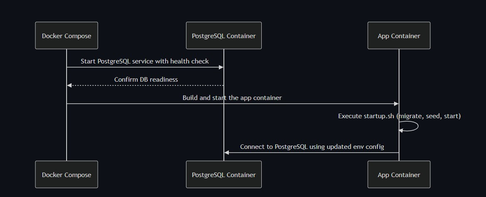
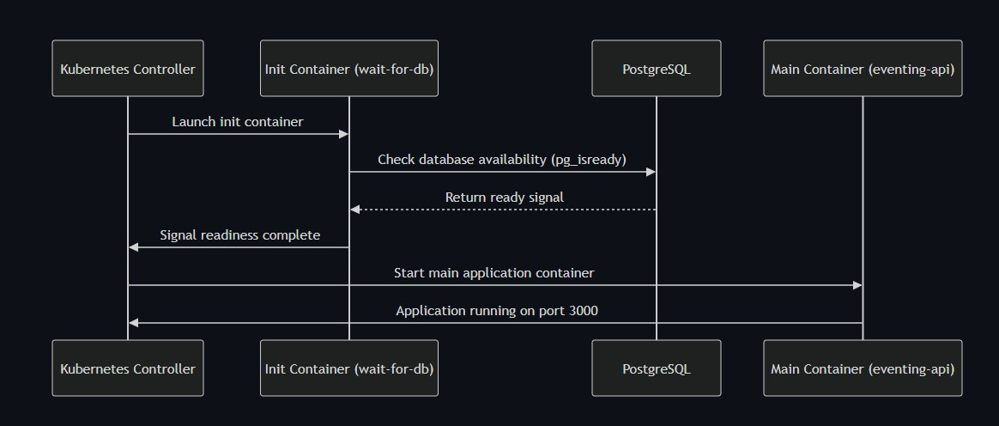

# Eventing API

A Node.js/Express API service for event management with TypeScript, PostgreSQL, Docker, and Kubernetes support.

## Architecture

### Docker Compose Setup


The Docker Compose setup provides:
- Node.js application container with hot-reload for development
- PostgreSQL database container
- Persistent volume for database storage
- Automatic database initialization and seeding
- Environment variable configuration

### Kubernetes Setup


The Kubernetes setup includes:
- Node.js application deployment with replicas
- PostgreSQL StatefulSet with persistent storage
- Init container for database readiness check
- Database initialization job
- LoadBalancer service for API access
- Configurable environment variables

## Project Structure

```
├── src/
│   ├── config/          # Configuration files
│   ├── controllers/     # Request handlers
│   ├── middleware/      # Express middleware
│   ├── routes/          # API routes
│   ├── services/        # Business logic
│   ├── types/           # TypeScript types/interfaces
│   ├── utils/           # Utility functions
│   ├── app.ts          # Express app setup
│   └── server.ts       # Server entry point
├── k8s/
│   └── local/          # Kubernetes manifests
├── scripts/            # Setup and utility scripts
├── views/              # Architecture diagrams
└── docker-compose.yml  # Docker Compose config
```

## Features

- TypeScript for type safety
- Express.js REST API
- PostgreSQL database with Sequelize ORM
- JWT authentication
- Swagger API documentation
- Docker and Kubernetes support
- GitHub Actions CI pipeline
- Development hot-reload
- ESLint and Prettier
- Jest testing setup

## Development Setup

1. **Prerequisites**
   - Node.js 20+
   - Docker Desktop
   - Kubernetes (optional, enabled in Docker Desktop)

2. **Initial Setup**
   ```bash
   # Run setup script
   chmod +x scripts/setup-dev.sh
   ./scripts/setup-dev.sh
   ```

3. **Development Options**

   Docker Compose:
   ```bash
   # Start services
   make docker-up
   
   # Start development server
   make dev
   ```

   Local Kubernetes:
   ```bash
   # Start services
   make k8s-up
   ```

4. **API Documentation**
   - Swagger UI: http://localhost:3000/api-docs

## Environment Variables

Configure in `.env` file:
```bash
# Development Database
DB_HOST=postgres
DB_PORT=5432
DB_NAME=eventing
DB_USER=postgres
DB_PASSWORD=postgres_password

# Test Database
TEST_DB_HOST=postgres
TEST_DB_PORT=5432
TEST_DB_NAME=eventing_test

# Production Database
PROD_DB_HOST=postgres
PROD_DB_PORT=5432
PROD_DB_NAME=eventing_prod
```

## Testing

```bash
# Run tests
npm test

# Run linting
npm run lint

# Run type checking
npm run typecheck
```

## Database Management

```bash
# Run migrations
npm run db:migrate

# Seed database
npm run db:seed:all

# Generate migration
npm run migration:generate -- create-new-table
```

## Contributing

1. Create feature branch:
   ```bash
   git checkout -b feature/new-feature
   ```

2. Make changes and ensure tests pass:
   ```bash
   npm test
   npm run lint
   npm run typecheck
   ```

3. Submit pull request to `develop` branch

## License

[MIT License](LICENSE)

